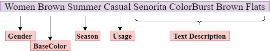

# Work In progress
**Successfully deployed an RNN based text model locally.**

*An E-Commerce App being deployed in 1 week...*

Original files could be found here in this [repository](https://github.com/nmariya/e-commerce-classifier) 

We aim to develop a front-end app using python Flask framewoork and deploy it as a service on the cloud. This is to mimick a real life scenario, where  we productionalize the machine learning pipeline.

Follow the instructions below to locally deploy the RNN text app to classify an e-commerce product given, *gender, base color, season, usage* and a *text description*.
##### Example:

1. Clone the repository into a desired location on your local machine.

      `git clone https://github.com/nmariya/ecommerce_predictive-app.git`

2. Open the folder in an IDE. ex. Visual Studio Code

3. Enter the following commands in the terminal

      `cd <location_of_folder>/application`
      `python app.py`

4. Once you see the Flask app running, you'll get a local http. *ex. http://localhost:5000/*

5. Click on the link and a local webpage will open up.

6. Now goto `./predict`  and you will see the prediction result of out sample input.

![]
